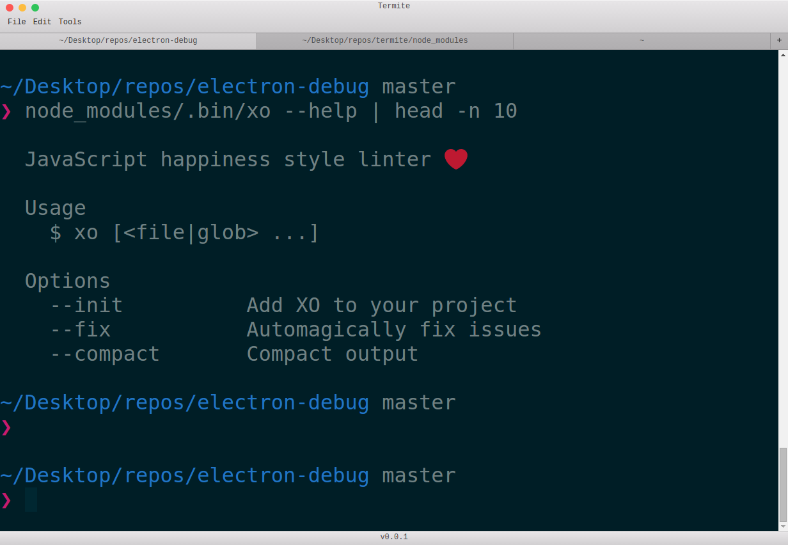

# termite

Awesome vt-100 terminal emulator.

## Installation

* Npm: Install with `npm install -g termite`

## Usage

Run termite after install and have fun!

## Features

- [X] Multitab interface
- [X] Colored emoji support
- [X] Highly configurable
- [X] iterm themes support
- [X] modular
- [ ] Draggable tabs
- [ ] High test coverage

## Credits

* shell is implemented using chromium hterm
* sublime text for inspiration

## License

The MIT License (MIT)

Copyright (c) 2015 Andrea Parodi

