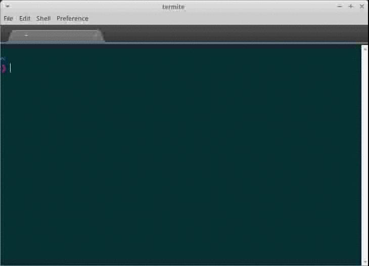

# termite

Termite is a vt-100 terminal emulator written in javascript and powered by electron.

## Installation

* Debian: download .deb packages from [releases files ](https://github.com/parro-it/termite/releases/download/v1.0.1/termite_1.0.1_all.deb)
* OSX: TODO
* Windows: TODO
* Npm: Install with `npm install -g termite`

## Usage

Run termite after install and have fun!

## Credits

* shell is implemented using chromium hterm
* sublime text for inspiration

## License
The MIT License (MIT)
Copyright (c) 2015 Andrea Parodi

